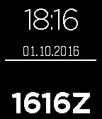

# ZuluWatchface
Dead-simple Pebble watchface displaying both date, local time, UTC time and battery status

-------
A simple Pebble watchface that displays (from top to bottom):
  * The local time (24h format)
  * The local date
  * The battery status as a white horizontal line: if the battery is fully charge, the line extends to the whole screen width, 
    then shrinks to the center as the charge level dimishes.
  * The UTC/Zulu time
  

